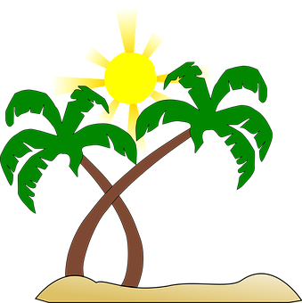
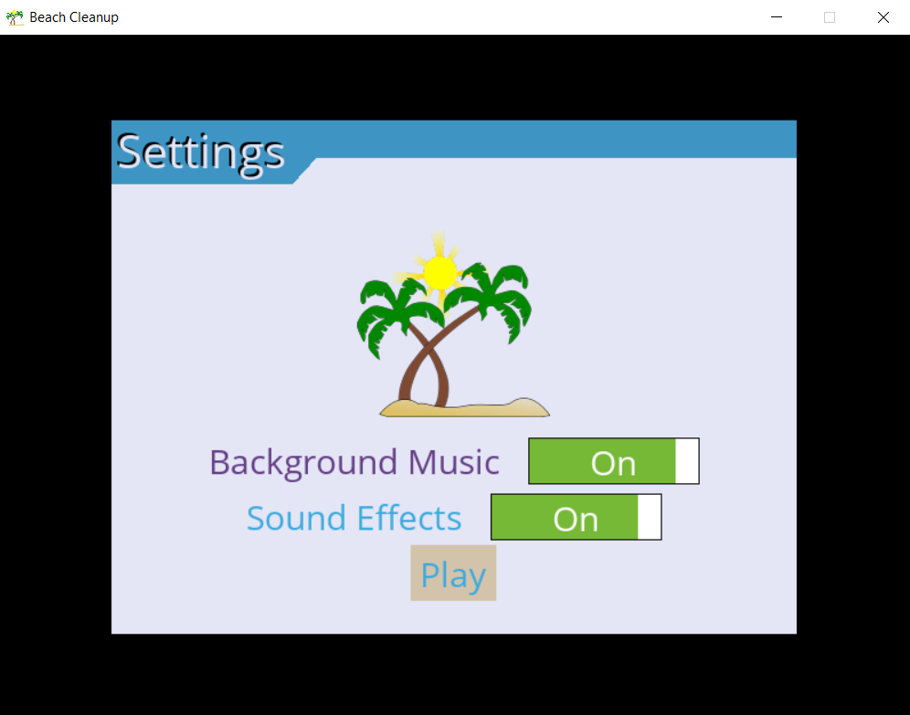
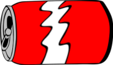
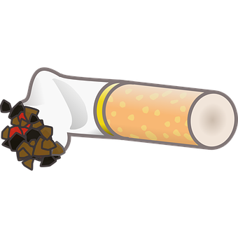
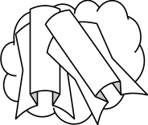
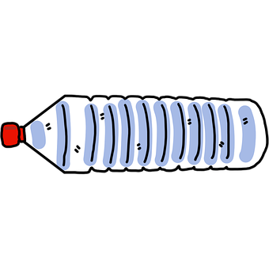
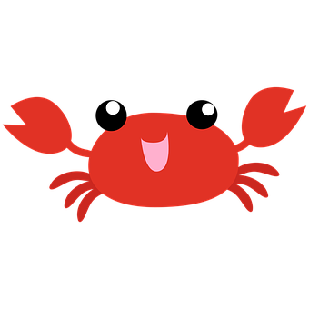
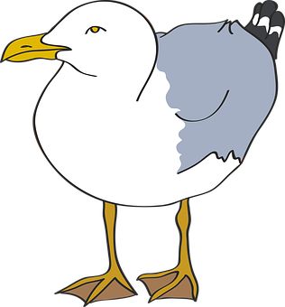
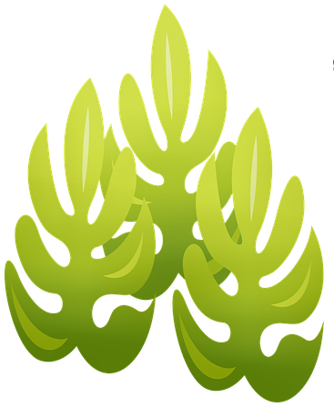
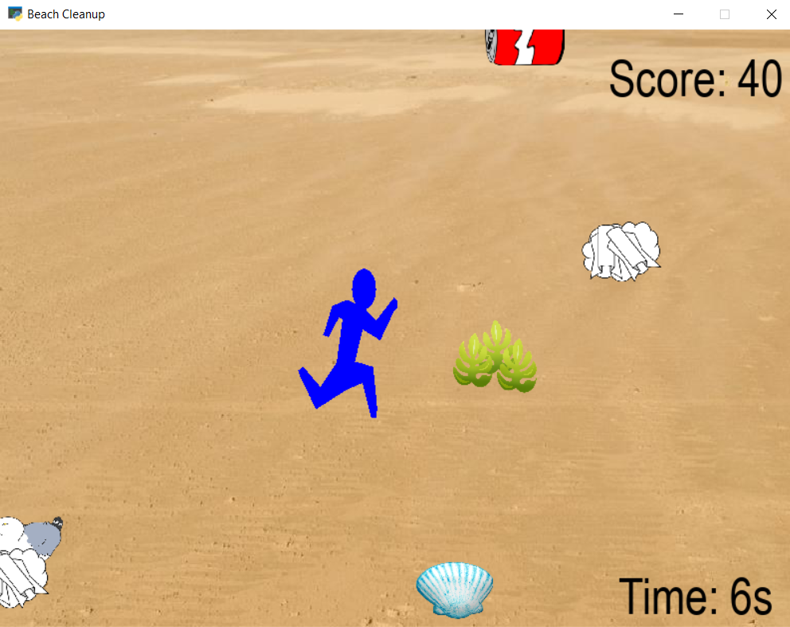

# Beach Clean-Up (Web)

Beach clean-up game where the player tries to pick up trash while avoiding the obstacles. Play it live at [amyweitzman.github.io/beach-cleanup-web](https://amyweitzman.github.io/beach-cleanup-web/).

> This is the browser version, rebuilt in vanilla JavaScript/HTML5 Canvas. The original Python/PyGame version is at [BeachHacks](https://github.com/AmyWeitzman/BeachHacks).

## How to Play

- The game starts by showing you a Settings screen. You can toggle background music and sound effects on/off.

- Once you hit the "Play" button, the game will begin. Pieces of trash and obstacles will be coming towards you. Move around the beach using the **arrow keys**. Your goal is to collect the trash and avoid the obstacles.

  - The pieces of trash are:  
    Soda Can: 
    Cigarette: 
    Paper Wad: 
    Water Bottle: 

  - The obstacles are:  
    Crab: 
    Seagull: 
    Seaweed: 

- Each piece of trash collected is worth **20 points**. If you run into an obstacle, the game is over.
- You can also collect seashells for bonus points. Each seashell is worth **100 points**.

## How to Run Locally

Just open `index.html` in any modern browser — no install or build step needed.

## Tech Stack

HTML5 Canvas · Vanilla JavaScript

---

Developed as part of BeachHacks 2021 · Web version 2026
